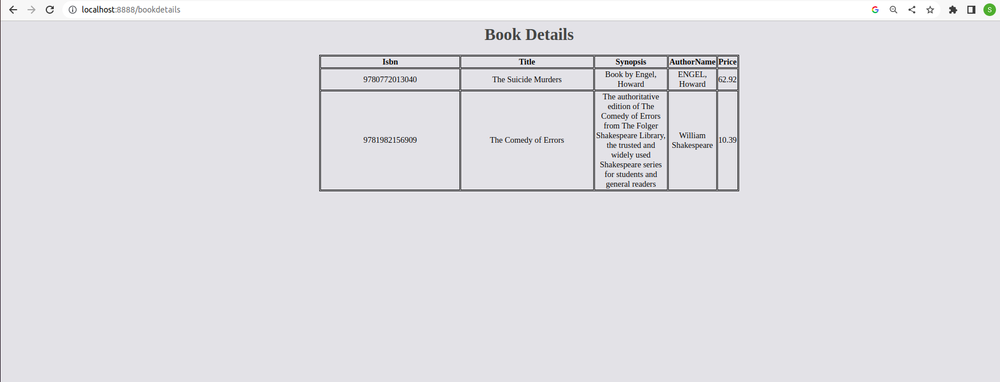

## Ruuning Program
**Pre-Requisites**
- docker-compose

**Start DB**
1. Clone the repo and navigate to final_assignment/database folder
2. create a new direcotry
```sh
sudo mkdir -p /mysql/data
```
3. run the docker-compose up command from database folder
```sh
docker-compose up -d
```
**Test the App**
1. navigate to final_assignment folder
2. run the the go test command
```sh
go test -v 
```
```
=== RUN   TestAddBookDB
--- PASS: TestAddBookDB (0.00s)
=== RUN   TestGetBooksDB
--- PASS: TestGetBooksDB (0.00s)
=== RUN   TestGetBookByTitleDB
--- PASS: TestGetBookByTitleDB (0.00s)
=== RUN   TestAddBookHandler
[GIN] 2022/12/05 - 13:49:18 | 201 |     118.751µs |                 | POST     "/addbook"
--- PASS: TestAddBookHandler (0.00s)
=== RUN   TestGetBooksHandler
[GIN] 2022/12/05 - 13:49:18 | 200 |     302.934µs |                 | GET      "/getbooks"
--- PASS: TestGetBooksHandler (0.00s)
=== RUN   TestGetBookByTitleHandler
[GIN] 2022/12/05 - 13:49:18 | 200 |      62.567µs |                 | GET      "/getbookbytitle/The Comedy of Errors"
--- PASS: TestGetBookByTitleHandler (0.00s)
PASS
ok  	github.com/shehbaz-pathan/go-assignments/fina-assignment/book-info	0.006s
```
**Build the App**
1. run the go build command
```sh
go build .
```
**Run the App**
1. book-info executable file will be get generated, execute the file it will start the web-server on port 8888 with all the routes
```sh
./book-info
```
**Operations**
- Add Book

```sh 
curl -XPOST http://localhost:8888/addbook -d '{"isbn": 9781982156909, "title": "The Comedy of Errors", "synopsis": "The authoritative edition of The Comedy of Errors from The Folger Shakespeare Library, the trusted and widely used Shakespeare series for students and general readers", "authorname": "William Shakespeare", "price": 10.39}'
```
Output
```
{
    "isbn": 9781982156909,
    "title": "The Comedy of Errors",
    "synopsis": "The authoritative edition of The Comedy of Errors from The Folger Shakespeare Library, the trusted and widely used Shakespeare series for students and general readers",
    "authorname": "William Shakespeare",
    "price": 10.39
}
```
- Get All Books
```sh
curl -XGET http://localhost:8888/getbooks
```
Output
```
[
    {
        "isbn": 9781982156909,
        "title": "The Comedy of Errors",
        "synopsis": "The authoritative edition of The Comedy of Errors from The Folger Shakespeare Library, the trusted and widely used Shakespeare series for students and general readers",
        "authorname": "William Shakespeare",
        "price": 10.39
    }
]
```
- Search Book By Book Titile
```sh
curl -XGET http://localhost:8888/getbookbytitle/The%20Comedy%20of%20Errors
```
Output
```
[
    {
        "isbn": 9781982156909,
        "title": "The Comedy of Errors",
        "synopsis": "The authoritative edition of The Comedy of Errors from The Folger Shakespeare Library, the trusted and widely used Shakespeare series for students and general readers",
        "authorname": "William Shakespeare",
        "price": 10.39
    }
]
```
- Books Details On HTML Page
```
http://localhost:8888/bookdetails
```

